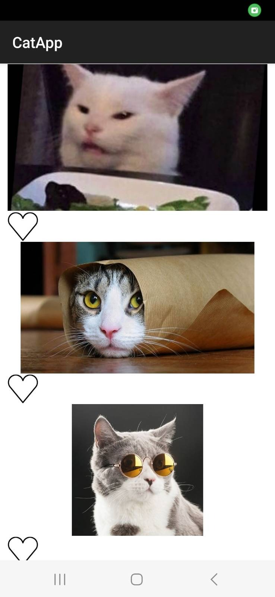

# catapp

## Description
This is an app used to demonstrate functionality of malicious android apps. It looks like a app for liking pictures of cats, but secretly it wil take pictures of the user with the front facing camera. 
The purpose of the app is to show users the importance android permissions and thinking twice about giving them.

## Prerequisites for installation 
- Have a machine running the evilcats-api on an reachable IP addresse. This addresse is needed for a small edit in the catapp code.
- Change the IP addresse for the HTTP POST request in the source code. 
  - Path to file: CatApp\app\src\main\java\com\example\catapp\Fragments\CatsFragment.kt
    - Change the IP addresse and port in line 105
    

## Installation
- Download android studio https://developer.android.com/studio
- Enable developer options for demo android device https://developer.android.com/studio/debug/dev-options#enable
- Connect the device to android studio (USB is recommended) https://developer.android.com/studio/run/device
- Run the app in the top right of the Android Studio window
- Allow the app to use camera

## Usage
With each click on the screen the app wil send pictures to the evilcats-api.

